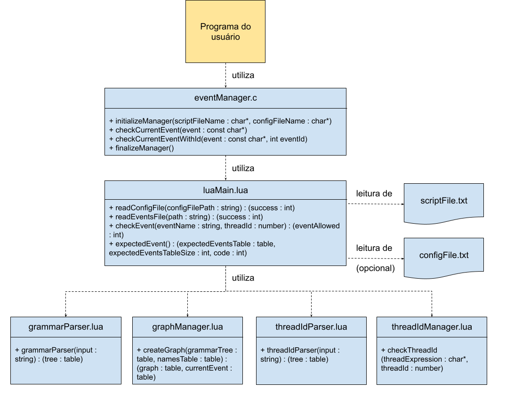

#Testes_Concorrentes
##Descrição

Este projeto tem como objetivo testar programas concorrentes desenvolvidos por alunos de graduação. Ele consiste em um módulo com funções a serem chamadas pelo programa do aluno que garantem que o mesmo siga uma determinada ordem de eventos. Essa ordem de eventos é criada em um arquivo de configuração e, se ela for aceita pelo programa do aluno ou não, é possível tirar conclusões acerca de sua corretude. 

Apesar de ter sido desenvolvido pensando em ser utilizado em disciplinas de graduação, o módulo pode ser utilizado em qualquer programa concorrente que utilize a biblioteca pthread em C.

###Escopo

O escopo do projeto consiste em desenvolver alguma ferramenta que fosse capaz de obrigar as threads de um programa a seguir determinada ordem de eventos, a fim de checar sua corretude. Assim, foi desenvolvido o módulo _StateManager_, cujas funções são chamadas pelo programa do usuário. 

O usuário define pontos chaves em seu programa que devem ocorrer em ordens específicas, chamados de estados. Exemplos de estados são pontos do programa antes da leitura de uma variável, antes e depois de uma região crítica, antes de uma thread ser colocada em espera, dentre outros. Cabe ao usuário definir estes estados e colocar no arquivo de configuração a ordem em que deseja que eles sejam executados. O projeto permite que o usuário crie os estados que desejar e informe se deseja que determinados estados sejam executados pela mesma thread ou se algum estado não pode ser executado por determinada thread.

O projeto inclui alguns exemplos de uso que podem ajudar o usuário a determinar bons estados para o seu programa e boas ordens para checar a corretude do mesmo. Eles estão documentados com explicações sobre seu funcionamento, forma de compilar e executar e com os testes realizados e seus significados.

Além disso, na seção [Como utilizar o módulo StateManager](#como-utilizar-o-módulo-statemanager), o usuário encontra explicações de como aplicar o módulo a fim de testar seu próprio programa.

###Requisitos funcionais

  * Fazer a leitura do arquivo de configuração do usuário.
  * Garantir que o programa do usuário siga a ordem especificada pelo arquivo de configuração.
  * Garantir que as threads executem os estados associados a elas pelo arquivo de configuração.
  * Permitir que o usuário defina o tempo máximo de um estado.
  * Finalizar o programa do usuário caso algum estado demore mais do que o tempo especificado.
  * Mostrar o próximo estado esperado caso o programa seja encerrado por conta de algum estado demorar demais.

###Requisitos não funcionais

  * O programa do usuário deve implementar a concorrência utilizando a linguagem de programação C e a biblioteca pthread.
  * O programa deve executar em uma máquina com sistema operacional Linux ou MacOS.
  * O usuário deve instalar Lua 5.3 na máquina, caso já não esteja instalado.
  * O usuário deve produzir um arquivo de configuração válido. Mais detalhes na seção [Como escrever o arquivo de configuração](#como-escrever-o-arquivo-de-configuração).

###Projeto do programa

Este projeto consiste no módulo _StateManager_ que deve ser chamado pelo programa do usuário. O usuário pode nomear o arquivo de configuração (Arquivo de ordem dos estados) da forma que quiser, só deve informar ao módulo o caminho para o arquivo.

O programa assume que o módulo _StateManager_ está em um diretório diferente do diretório no qual o programa do usuário é compilado e executado, como mostrado a seguir. Entretanto, o usuário pode modificar este caminho no arquivo _stateManager.h_.

.  
|---Diretório externo  
| |---Pasta com programa do usuário  
| | |---main.c  
| | |---statesFile.txt  
| |---StateManager  
| | |---stateManager.c  
| | |---stateManager.h  
| | |---readStates.lua  

A imagem a seguir contém a arquitetura do projeto.

##Como utilizar o módulo StateManager

###Configuração

Primeiramente, o usuário deve baixar a pasta com o módulo _StateManager_ e, idealmente, organizá-la como é descrito na seção [Projeto do programa](#projeto-do-programa). Para casos diferentes de organização, basta modificar a variável _readStatesFilePath_, presente no arquivo _stateManager.h_.

Além disso, o usuário deve se certificar de que todos os [requisitos não funcionais](#requisitos-não-funcionais) foram cumpridos.

###Como escrever o arquivo de configuração

O próximo passo é escrever um arquivo de configuração válido. Este arquivo contém a ordem de todos os estados do programa e regras de execução para as threads.

Ele deve ser um .txt no qual cada linha segue o padrão:
"Nome do Estado" "Espaço em branco" "Regra de execução"

* Nome do Estado: O usuário deve se certificar de colocar um nome que não contenha espaços em branco nem caracteres como '\t', '\n' ou '\0'. Estes estados devem estar escritos da mesma forma como serão escritos no programa do usuário, cabendo ao usuário garantir isto.
* Espaço em branco: Forma do programa reconhecer a separação entre o nome do estado e a regra de execução da thread. O usuário deve evitar realizar esta separação com '\t' ou outro caracter.
* Regra de execução: Aqui, o usuário escolhe se deseja que uma mesma thread execute determinados estados ou se uma thread não pode executar determinado estado. Sendo assim, a "Regra de execução" pode ter os seguintes valores:
  * Número inteiro positivo: Todos os estados com o mesmo número inteiro positivo serão executados pela mesma thread.
  * '!' seguido por Número inteiro positivo: Todos os estados que possuírem essa identificação poderão ser executados por qualquer thread menos a que corresponde àquele número inteiro positivo. Esta identificação só pode ser utilizada caso o usuário tenha associado este número inteiro positivo a algum estado anterior no arquivo.
  * '*': Indica que aquele estado pode ser realizado por qualquer thread, sem nenhuma regra.

O exemplo a seguir mostra um arquivo de configuração válido:
> EstadoA * EstadoB 1 EstadoC 1 EstadoE 2 EstadoF !1 EstadoG 2 EstadoH * 

Neste exemplo, o EstadoA pode ser executado por qualquer thread. A seguir, o usuário definiu que o EstadoB e o EstadoC devem ser executados pela mesma thread. O número 1 não garante que a primeira thread criada é a que executará estes estados, ele somente os associa entre si. É importante notar que estes estados podem ser executados pela mesma thread que executou o EstadoA ou não, já que este estado não possui nenhuma restrição.

Quanto ao EstadoE, por enquanto, o programa aceitaria que a mesma thread que executou o EstadoB e o EstadoC o executasse. Os números usados como regras de execução ainda possuem algumas limitações, discutidas melhor em [Passos futuros](#passos-futuros).

Já o EstadoF poderia ser executado por qualquer thread menos pela thread que executou os estados EstadoB e EstadoC.

###Chamadas às funções

Para utilizar o _StateManager_, o usuário deve fazer chamadas às suas funções no seu programa.

Para inicializar o módulo, basta chamar a função _initializeManager_, passando como argumentos o caminho para o arquivo de configuração (também chamado de arquivo de ordem de estados) e o número de threads criadas pelo usuário.

Chamadas à função _checkState_ devem ser feitas em pontos chave do programa, nos quais o usuário quer se certificar de que determinado estado ocorra em determinado momento. Ele deve passar como argumento para esta função o nome do estado que ele deseja que seja associado àquele ponto do programa. Este nome deve existir no arquivo de configuração.

Por último, antes de encerrar seu programa, o usuário deve chamar a função _finalizeManager_, para garantir que os espaços alocados pelo módulo _StateManager_ sejam liberados.

Para mais detalhes acerca destas funções, cheque a [documentação](./StateManager/README.md) do módulo _StateManager_.

Agora, o usuário está pronto para compilar, executar e interpretar os resultados obtidos.

###Compilando e executando

É necessário compilar o código do _StateManager_ em conjunto com o código do usuário. Caso a disposição das pastas esteja de acordo com o que é mostrado em [Projeto do programa](#projeto-do-programa),

##Sobre os resultados

##Exemplos de uso

##Testes

##Passos futuros